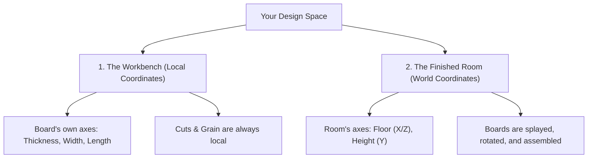

# Sketch CAD: User Manual & Quick Start Guide

Welcome to **Sketch**! If you know how to pick a board from a lumber rack, mark it with a pencil, cut it on a saw, and join it with screws or glue, you already know how to use Sketch. 

This guide is written specifically for woodworkers. No CAD or engineering experience required!

---

## 1. Quick Start: Your First 5 Minutes in the Shop

Let’s build a simple **Step Stool** to learn the basics.

### Step 1: Pull a Board from the Lumber Rack
1.  Click the **Components** button in the header bar.
2.  Click **Custom Board**.
3.  Name it `Stool Top`.
4.  Set the dimensions using the app's coordinate input fields:
    *   **Length/X/Red dimension:** 18"
    *   **Width/Z/Blue dimension:** 10"
    *   **Thickness/Y/Green dimension:** 0.75" (3/4")
5.  Click **Add Component**. The board appears right at the center of your screen!
    *   **Note:** This positions the new board at the absolute center of our workspace and as a result, half of the board is under the work surface. Look at the Inspector Panel and click on the button that says, "Set on Floor", and it will move the board to the working surface 'floor'.

### Step 2: Add the Legs
1.  Click **Custom Board** again.
2.  Name it `Stool Leg A`.
3.  Set the dimensions:
    *   **Length/X/Red dimension:** 12"
    *   **Width/Z/Blue dimension:** 8"
    *   **Thickness/Y/Green dimension:** 0.75" (3/4")
4.  Click **Add Component**. It will appear overlapping the top. Don’t worry, we will move it in the next step!

### Step 3: Nudge the Leg into Position
1.  Click on `Stool Leg A` in the 3D window to select it.
2.  Open the **🛠 Tools** panel (or look at the **Inspector** panel).
3.  We want to move the leg so it sits *under* the top.
4.  Use the **Nudge** or **Flush** controls:
    *   Click the top face of the leg and the bottom face of the stool top, then click **Make Flush** (or use the splayed offset of 0"). The leg snaps perfectly underneath the top!
    *   Use the arrow buttons to nudge it left or right by 1" increments until it sits 1.5" inset from the end.

### Step 4: Check Your Shop Sheet (The Cut List)
1.  Click the **📋 Cut List** icon in the header.
2.  An active sheet appears showing:
    *   `1× | Stool Top | Cherry | 3/4" × 10" × 18"`
    *   `1× | Stool Leg A | Cherry | 3/4" × 8" × 12"`
3.  As you design, this list updates instantly. You can print it out and take it directly to your table saw!

---

## 2. The Golden Concept: "The Workbench" vs. "The Room"

One of the most important concepts to understand in Sketch is the difference between a board's **Local** and **World** coordinates. 

We explain this using two distinct workspaces: **The Workbench** and **The Finished Room**.

### 1. The Workbench (Local Coordinates)
Think of a single board lying flat on your workbench in the shop.
*   **Thickness** is how thick the wood is from the face you are looking at to the bench surface.
*   **Width** is across the grain (from left edge to right edge).
*   **Length** is along the grain (from end to end).
*   **The cuts you make** (like a 45° miter or a tilted bevel cut) are marked and cut relative to *this board alone*. If you flip the board or carry it across the room, the cuts and the length of the board do not change.

> [!IMPORTANT]
> **In Sketch:** When you edit a board's length or adjust a miter/bevel cut, you are working in its **Local Coordinates**. Even if the board is rotated or tilted in your finished model, typing a longer length will stretch the board **along its grain**, not straight up into the air!

### 2. The Finished Room (World Coordinates)
Now, imagine assembling your furniture piece inside a room.
*   **World Y (Height):** Points straight up from the floor.
*   **World X & Z (Floor):** Points left-to-right and front-to-back across the workshop floor.
*   Once you rotate a board (for example, angling a table leg outward by 10° for a splayed-leg look), its local axes are tilted. "Up" for the board is no longer "up" for the room.

### How to Move and Adjust Tilting Boards
When a board is rotated, Sketch gives you two intuitive ways to move it:
1.  **"Slide along board" (Local Movement):** Moves the board along its own tilted axis. Perfect for sliding a table leg up or down its splayed angle to adjust floor contact, or sliding a shelf deeper into a cabinet.
2.  **"Move in project" (World Movement):** Moves the board straight up, down, left, or right relative to the room floor. Perfect for centering an entire assembly or shifting a drawer face.

### Rotating & Orienting: No Airplane Pilot Required
Unlike other CAD programs that ask you for "Pitch, Yaw, and Roll" (terms best suited for pilots!), Sketch uses simple woodworking actions to rotate your boards:
*   **Tilt Front/Back (X-Axis):** Leans the board forward or backward. Think of a ladder leaning against a wall.
*   **Spin Flat (Y-Axis):** Spins the board flat on the table, like a turntable or a clock hand. Use this to turn a horizontal shelf so it runs front-to-back instead of left-to-right.
*   **Tilt Left/Right (Z-Axis):** Leans the board sideways. Excellent for creating splayed legs or angled dividers.

All rotations are done in simple degree increments (like 5° or 45° or 90°), and you can instantly flip a board 180° with a single click in the **Inspector** panel.

---

## 3. Making Cuts: Miters and Bevels

In the real world, you use a miter saw or table saw to cut angles. In Sketch, we use the exact same terms:

### Miters (Turntable Swing)
*   **What it is:** Tilted cut across the *width* of the board (swinging the miter saw arm left or right).
*   **Real-world use:** Picture frames, box corners, and mitered cabinet face frames.
*   **In Sketch:** Open the **🛠 Tools** panel, select a board, and adjust the **Miter** slider (from 0° to 60°).

### Bevels (Blade Tilt)
*   **What it is:** Tilted cut through the *thickness* of the board (tilting the saw blade from vertical).
*   **Real-world use:** Slanted boxes, hexagonal columns, or compound miter joints.
*   **In Sketch:** Adjust the **Bevel** slider (from -60° to +60°).
    *   *Positive Bevel:* Tilts the blade starting from the bottom face.
    *   *Negative Bevel:* Tilts the blade starting from the top face.

---

## 4. Troubleshooting & Pro-Tips

*   **Why is my board highlight red?**
    *   Sketch has **Collision Detection** enabled by default. If a board turns red or a warning badge appears at the top, it means two boards are physically occupying the same space (clipping). Use the **Flush** tool or **Nudge** arrows to slide them flush against each other.
*   **How do I undo a mistake?**
    *   Click the **↺ Undo** button in the top menu or press `Ctrl + Z`. Sketch keeps a full history of your session, so you can safely experiment!
*   **My input values keep changing slightly!**
    *   Sketch has an auto-clamp safeguard. If you type a value that is physically impossible (like a negative thickness or a bevel greater than 60°), Sketch will clamp it to a safe value and display a helpful notice so your design doesn't break.
*   **Can I switch between Inches (Imperial) and Millimeters (Metric)?**
    *   Yes! You can toggle between **Imperial** and **Metric** at any time in the **Settings** panel. Switching mid-project will **never** alter your actual geometry or corrupt your work—Sketch handles all conversions dynamically under the hood, and your grid snapping automatically updates to sensible metric increments (like 1 mm or 5 mm).
