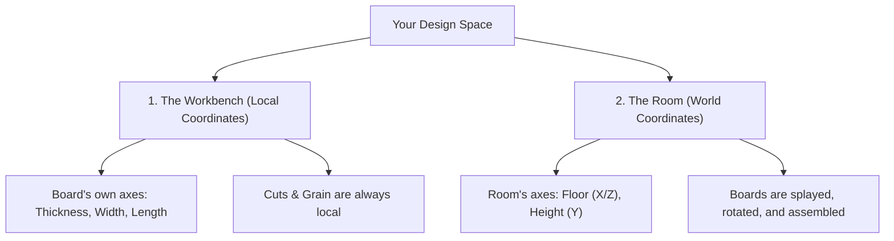

# Sketch: A Parametric Design Tool for Woodworkers
# User Manual & Quick Start Guide

Welcome to **Sketch**! If you know how to pick a board from a lumber rack, mark it with a pencil, cut it on a saw, and join it with screws or glue, you already know how to use Sketch. 

This guide is written specifically for woodworkers. No drafting or engineering experience required!

Luceysketch is definitely a work in progress, as is this User's Guide. It is provided as is, with no warranty. It is provided in the spirit of open source software, for the benefit of the woodworking community, and as such, *you* can help make it better. Please use the [**GitHub Discussions**](https://github.com/vinyasa/sketch/discussions) feature to start a thread about any issues or suggestions you might have.

---

## 🎛️ 1. Panel Menu & Main Buttons

Before diving into sawdust, let's look at the primary controls in your shop header. These are the tools you'll use to manage files, spawn boards, shape joints, and inspect dimensions.

### The Header Controls (by Column, Top-to-Bottom):

*   **Column 1:**
    *   **🔷 Components**: Your virtual lumber rack. Click this to spawn standard custom boards, lumber sheets, or pre-configured procedural assemblies (like table bases or carcasses).
    *   **🧱 Builders**: Opens the parametric builders panel to quickly design complex assemblies like cabinet carcasses, face frames, drawers, and shelving.
    *   **📦 Library**: Accesses your custom shop storage. Save custom sub-assemblies (like a custom drawer box or face-frame design) and drop them instantly into any new project.
*   **Column 2:**
    *   **📷 Perspective / 📐 Parallel**: Toggles the viewport camera mode between realistic 3D Perspective and engineering-focused Parallel (Orthographic) view.
    *   **🧰 Tools**: The heart of the woodworking interface. Accesses all interactive tools for shaping individual boards (holes, dados, coves, dowels) or joining boards (rabbets, miters, box insets, boolean notches).
    *   **🎨 Materials**: Opens the Paint & Material selector. Apply high-fidelity, photorealistic wood grains (Walnut, Cherry, Maple, Oak, etc.) or custom paint finishes to the selected components.
*   **Column 3:**
    *   **📏 Measure**: Toggles standard measuring tape mode to check custom spans, clearances, and board gaps inside the viewport.
    *   **📋 Cut List**: Your active Shop Sheet! Generates a live-updating materials breakdown, complete with board names, wood species, and exact dimensions.
    *   **💡 Lighting**: Configures the 3D lighting environment (Bright Shop, Moody Studio, Soft Sunlight) to check your shadow lines, reveals, and visual depth.
*   **Column 4:**
    *   **🗂️ Outliner**: Toggles the project tree view sidebar to organize individual boards, group them into Assemblies, and manage parent-child relationships.
    *   **⚙️ Settings**: Toggles snapping grids, switches between Imperial (Inches) and Metric (Millimeters) systems, and configures collision detection or safe clamping limits.
    *   **🎬 Animate**: Opens the animation setup card to define swings (for doors) or slides (for drawers), helping you inspect door and drawer clearances.
*   **Column 5:**
    *   **Grid Checkbox**: Instantly toggles the floor grid snapping lines on or off in the 3D viewport.
    *   **Dims Checkbox**: Toggles automatic dimensional labels showing raw board lengths directly inside the viewport.
    *   **C5R3 (Empty)**: *Reserved for future implementation.*

*(Note: **📁 File** and **↺ Undo** remain located in the separate Left Card logo bar for global file saves, disk exports, and rapid 25-step undo history).*

> [!TIP]
> **Click & Explore!** There are no permanent mistakes in Sketch. We highly encourage you to click each button in the header, hover over tools, and experiment with options. Discovering features is half the fun!

---

## 🚀 2. Quick Start: Your First 5 Minutes in the Shop

Let’s build a simple **Step Stool** to learn the basics.

### Step 1: Pull a Board from the Lumber Rack
1.  Click the **File** menu in the header. Click **New Project** and then click **Discard (Clear Workspace)**.
2.  Click the **Components** button in the header bar.
3.  Click **Custom Board** and set its properties:
    *   **Name:** `Stool Top`
    *   **Length/X/Red dimension:** 12"
    *   **Width/Z/Blue dimension:** 10"
    *   **Thickness/Y/Green dimension:** 0.75" (3/4")
    *   **Position:** [X: 0", Y: 0", Z: 0"]
    Click **Add Component**.

    *   **Note:** This positions the new board at the absolute center of our workspace and as a result, half of the board is under the work surface (by 3/8" or 0.375").
4.  Look at the Inspector Panel for `Stool Top` and click on the button that says, "Set on Floor", and it will move the board up by 3/8" to the working surface 'floor'.
5.  We want to move the Stool Top up 12" so that we can set the legs under the top. In the Inspector Panel for `Stool Top`, set **Position/Y/Green dimension** to 12.375".

### Step 2: Add a Leg
1.  Click **Custom Board** again.
2.  Name it `Stool Leg A`.
3.  Set the dimensions:
*   **Thickness/X/Red dimension:** 0.75" (3/4")
*   **Width/Z/Blue dimension:** 10"
*   **Length/Y/Green dimension:** 12"
4.  Click **Add Component**.

### Step 3: Move the Leg into Position
1.  Look at the Inspector Panel for `Stool Leg A` and click on the button that says, "Set on Floor", and it will move the board to the working surface 'floor'.
2.  In the Inspector Panel for `Stool Leg A`, set **Position/X/Red dimension** to -6". This moves the leg toward the left side of the top, but it's still not flush with the edge of the top. We will fix that in the next step.
3.  Select `Stool Leg A`. In the Inspector Panel, click **+ Add Flush Alignment**.
*   Click the **Left** face on `Stool Leg A`.
*   Click the **Left** face on `Stool Top` to align them. (Be sure to click them in that order! The first component you click is the one that is moved. In this case, the leg is moved to match the position of the top.)

### Step 4: Clone the Leg and Align the Second Leg  
1.  In the Inspector Panel for `Stool Leg A`, under **Clone Component**:
*   Click the **World X** button.
*   Set the **Offset** to `11"`.
Click **Clone along X** to create a clone named `Stool Leg A 2`. Rename it to `Stool Leg B`

2.  Select `Stool Leg B`. In the Inspector Panel, click **+ Add Flush Alignment**.
*   Click the **Right** face on `Stool Leg B`.
*   Click the **Right** face on `Stool Top` to align them.

### Step 5: Group the Components into an Assembly
1.  In the **Outliner** panel, click **+ Assembly** to create a new assembly `Assembly xxx`. Rename it to `Stool`.

2.  In the **Outliner** panel, click on `Stool Leg B` to select it.
3.  Shift-click on `Stool Leg A` to add it to the selection.
4.  Shift-click on `Stool Top` to add it to the selection.
5.  In the **Outliner** panel, drag the component(s): `Stool Leg B`, `Stool Leg A`, `Stool Top` and drop under the `Stool` assembly to group them.

### Step 6: Apply Materials to Components 
1.  Click the **Materials** panel button to open the Paint & Materials selector.
2.  Select `Stool Leg A`. Shift-click `Stool Leg B`.

3.  In the **Materials** panel, select `maple` wood type. This will apply the wood type `maple` to the selected boards.

4.  Select `Stool Top`.

5.  In the **Materials** panel, apply the wood type `walnut` to the selected board.

### Step 7: Check Your Shop Sheet (The Cut List)
1.  Click the **📋 Cut List** icon in the header.

2.  An active sheet appears showing:
    *   `1× | Stool Top | Walnut | 12" × 10" × 0.75"`
    *   `2× | Stool Leg | Maple  | 12" × 10" × 0.75"`

    *   **Note:** As you design, this list updates instantly. You can print it out and take it directly to your shop!

---

## 🧱 3. Procedural Cabinet Builders

Sketch includes a set of automated **Cabinet & Box Builders** that let you structure furniture in seconds. These procedural tools handle the math, grain direction, and board thickness offsets for you.

### The Cabinet Workflow:
1.  **Build the Carcass First**:
    Select **Cabinet** under the *Builders* menu. Define the height, width, depth, backing style (flush, inset, or none), and wood thickness. Click **Build Cabinet** to spawn a structured cabinet box.
2.  **Add Shelves**:
    Select the Cabinet and click **Shelving**. Define how many shelves you want. The builder dynamically spaces them evenly.
3.  **Add Drawers**:
    Click **Drawers** under the *Builders* menu. Choose drawer spacing, runner clearances (defaults to 1/2" side spacing for standard drawer slides), and drawer box heights. The builder will automatically generate all matching drawer panels and faces!
4.  **Add Doors**:
    Click **Door** under the *Builders* menu. Select between **Inset Doors** (flush with the cabinet face) or **Overlay Doors** (overlapping the edges). Adjust the reveal gap (typically 3/32" or 2mm). You can also add a Face Frame to the cabinet if you desire.

---

## 📐 4. The Golden Concept: "The Workbench" vs. "The Room"

One of the most important concepts to understand in Sketch is the difference between a board's **Local** coordinates and **World** coordinates. 

We explain this using two distinct workspaces: **The Workbench** and **The Room**.

### 1. The Workbench (Local Coordinates)
Think of a single board lying flat on your workbench in the shop.
*   **Thickness (Local Y / Green):** How thick the wood is from the face you are looking at to the bench surface. We often build with boards that are 3/4" thick.
*   **Width (Local Z / Blue):** Across the grain (from front edge to back edge). We might have a board that is 6" wide.
*   **Length (Local X / Red):** Along the grain (from left to right or end to end). We might have a board that is 48" long.
*   **The cuts you make** (like a 45° miter or a dado slot) are marked and cut relative to *this board alone*. If you flip the board, rotate it, or carry it across the room, the cuts and the length of the board do not change.

> [!IMPORTANT]
>
> Every board that is created has its own set of colored axes (Red along the x-axis, Green along the y-axis, Blue along the z-axis). When you add a board to your project, its local axes are initially aligned with the world axes. If the board is rotated or tilted, its local axes will no longer be aligned with the world axes. 
>
> When you edit a board's length or adjust a miter/bevel cut, you are working in its **Local Coordinates**. Even if the board is rotated or tilted in your finished model, adjusting its length will stretch the board **along its grain**, regardless of its orientation in **World Coordinates**.

### 2. The Room (World Coordinates)
Now, imagine assembling your furniture piece inside a room.
*   **World Y (Height):** Points straight up from the floor.
*   **World X & Z (Floor):** Points left-to-right and front-to-back across the workshop floor.
*   Once you rotate a board (for example, angling a table leg outward by 10° for a splayed-leg look), its local axes are tilted, but "up" for the board is still "up" in the room (World Y).

### Rotating or Tilting Boards
When a board is created, its point of rotation is in the center of the board (in world coordinates x, y, and z). If you want to rotate a board around a different point, you can do so by moving the pivot point in the **Inspector** panel. For a door, you may want the pivot point to be at the Top-Left-Back. Once a pivot point has been extablished, you can use the tilt and spin controls in the Local Orientation section of the **Inspector** to rotate the board around that pivot point.

Luceysketch uses simple woodworking actions to rotate your boards:
*   **Tilt Front/Back (X-Axis):** Leans the board forward or backward. Think of a ladder leaning against a wall.
*   **Spin Flat (Y-Axis):** Spins the board flat on the table, like a lazy susan. Use this to turn a horizontal shelf so it runs front-to-back instead of left-to-right.
*   **Tilt Left/Right (Z-Axis):** Leans the board sideways. Excellent for creating splayed legs or angled dividers.

All rotations are done in simple (settable) degree increments (like 5° or 45° or 90°), and you can instantly flip a board 180° with a single click in the **Inspector** panel.

---

## 🔗 5. Smart Constraints: Flush & Glue

To make modeling fast and parametric, Sketch implements a powerful **Smart Constraint System**. Instead of entering math coordinates for every board movement, you establish relations between them.

### The Two Constraints:
1.  **Flush Alignment (locks 1 axis)**:
    Binds two faces to stay perfectly coplanar. If the faces of two boards need to be aligned, but they are currently not, then you need to make one of the boards move in alignment with the other. Click the **Add Flush Alignment** button in the Inspector panel and then click on the face of the board you want to move (Pointing at the faces will highlight them). Then click on the face of the board you want to align it with. The first board will move into alignment with the second board.
2.  **Glue Joint (locks all 3 axes)**:
    Rigidly attaches two components as a single physical unit. Glued boards always move together. If you glue a drawer front to a drawer box, moving the drawer box forward will pull the drawer front along with it.

### Why Constraints Are Game-Changers:
Imagine you have designed a full chest of drawers. If you select the whole assembly or an entire sub-assembly, and click **Glue Assembly**, then you can move the whole assembly by moving the position of just one board.

---

## 🪚 6. Miters, Bevels & Contextual Tool Options

In the real world, you use a miter saw or table saw to cut angles. In Luceysketch, we use the exact same terms:

### Miters (Turntable Swing)
*   **What it is:** Angled cut across and face of a board (swinging the miter saw arm left or right).
*   **Real-world use:** Picture frames, box corners, and mitered cabinet face frames.
*   **In Luceysketch:** Open the **Tools** panel, select a board, and adjust the **Miter** slider (from 0° to 60°).

### Bevels (Blade Tilt)
*   **What it is:** Tilted cut through any face of a board (tilting the saw blade from vertical).
*   **Real-world use:** Slanted boxes, tapered legs, or compound miter joints.
*   **In Luceysketch:** Adjust the **Bevel** slider (from 0° to 60°).
    *   *Tilt left:* Shortens the face the blade cuts first.
    *   *Tilt Right:* Shortens the opposite face.

> [!NOTE]

> You are able to orient your boards in any fashion before making a cut, unlike the restrictions of your shop miter saw.
>
> Whenever you are applying a miter or bevel, spin your view around in world space so that the wood is to the left of the virtual sawblade. In the example of tapering a table leg, the 4 faces you will bevel will be the right, back, left, and front faces, spinning the view 90 degrees after each cut. It is not required to spin the view, but it helps to keep your perspective similar to how you would make cuts in your shop.
>
> In the example above, you can taper your table legs on the virtual miter saw, whereas in your shop you would have to use a table saw with a tapering jig or a band saw.

### Context-Dependent Interfaces
The Cuts panel changes dynamically based on **what is currently selected**:
*   **No selection**: Tells you to select a board to begin.
*   **1 Board Selected**: Displays individual cutting tools (Hole, Dado, Cove, Dowel, Pocket Holes) and lists all applied modifiers.
*   **2 Touching Boards Selected**: Reveals the **Edge Joint** interface, offering immediate Butt joints, Rabbets, Miters, and ⇄ Flips.
*   **2 Overlapping Boards Selected**: Reveals the **Boolean Subtract** tool to notch or mortise one board directly using the shape of the other.
*   **5-Board Box Selected**: Unlocks advanced drawer bottom **Box Inset** tools.

---

## 📏 7. Shop Measurements & Perspective

Getting wood to align requires checking your work from multiple viewpoints.

### Shop Measurements
You can inspect dimensions dynamically using the **Measure Tool** or simply by selecting a board to view its raw lengths in the Inspector. The grid displays snapping lines in your selected unit increment, making it simple to gauge gaps and reveals.

### Why Changing Perspectives is Vital
When working in a 3D canvas, viewing your model from a single angle can be deceptive. A shelf may look perfectly aligned with a divider from the front, but once you spin the camera, you might discover a massive gap behind it!

Use the quick-camera perspective buttons in the center:
*   **Front View**: Perfect for checking face-frame alignments and shelf heights.
*   **Top View**: Ideal for aligning drawer depths, reveals, and checking cabinet carcass dimensions.
*   **Side View**: Essential for verifying that backing sheets are flush or set in rabbets properly.

---

## 🎬 8. Animating Doors & Drawers

To verify doors swing cleanly and drawers clear face frames, Sketch includes **Interactive Animations**.

### Setting Up Animations:
1.  Select a door. Click on the Animate button.
2.  In the **Animation** panel, click **Set Start**.
3.  Rotate the door to an open position.
4.  Click the **Play** button.

---

## 📦 9. Assemblies & Custom Library

Woodworking projects are made of individual boards grouped into sub-components (like drawer boxes, legs, door frames, or tabletops).

### Building Assemblies:
1.  In the **Outliner** panel, click **+ Assembly** to create a group. Give it a name.
2.  Select all boards that belong together.
3.  Drag and drop the selected boards under your new assembly.

### Saving to Your Custom Library:
Once you have created a perfect sub-component—such as a custom drawer box with edge dados and pocket holes—you don't want to design it again from scratch.
1.  Select the assembly in the Outliner.
2.  Click on the Library button in the header.
3.  Click **Add Selected Assembly to Library** in the Library panel.
4.  Give it a name and click, **Save to Library**.
The assembly is saved to your persistent **Library panel**. You can place this custom assembly into any new project in the future.

---

## 🛠️ 10. Interactive Tool Guide

Here is a quick reference guide to using each interactive tool inside the **🪚 Tools** panel:

### Individual Cutting Tools:
*   **◎ Hole Tool**: Adds circular through-holes. Drag the slider to set the diameter. Position it using dynamic offsets that automatically update based on the hole's drilling axis (e.g., Offset X/Z for Y-axis holes, Offset Z/Y for X-axis holes). Changing the axis automatically converts offsets to preserve the hole's 3D physical center position.
*   **◡ Cove Tool**: Route curved cove channels along the edges. Select which edge to cut and specify depth.
*   **◠ Arc Tool**: Rounds off corners or creates arches. Specify start/end angles (e.g. 0° to 90°) to route soft, curved profiles.
*   **✂ Dado Tool**: Cuts rectangular grooves. Set width (e.g., 3/4" for shelf thickness), depth (commonly 1/4" or 3/8"), and position offset. Drag the slider to slot shelves in side carcass panels.
*   **⊿ Miter Tool**: Cuts angles on board ends or faces. Swing miter angles up to 60° to fit picture frame joints.

### Structural Joint Tools:
*   **pocket-holes Pocket Holes**: Automatically space pocket screw pocket joints on board backs or bottom faces. Set count and spacing to 'auto'.
*   **dowel-holes Dowels**: Drills structural dowel pins. Define hole diameters (1/4", 3/8", 1/2") and depth to mate boards rigidly.
*   **🔗 Edge Joints**: Select 2 touching boards to apply Single Rabbets, Dual Rabbets, Miters, or Butt joints. Click `⇄ Flip` to switch which board receives the recess.
*   **🔪 Boolean Subtract**: Select 2 overlapping boards. Click `A - B` to carve board B's exact overlap out of board A or vice versa.

---

## 🎨 11. Materials, Lighting & Settings

Once your structural carpentry is complete, use the styling panels to check its aesthetic look and configure app behavior.

### Paint, Grain & Environment Lighting
*   **Paint & Grains**: Open the **Materials Panel** and click on Maple, Cherry, Oak, Walnut, or a custom paint finish to style your boards.
*   **Lighting**: Open the **Lighting Panel** and switch between *Bright Shop*, *Moody Studio*, or *Soft Sunlight*. Rotate the light direction to see how shadows cast across your joints, helping you check reveals and visual depth.
*   *Tip: We encourage experimenting! Test different grain combinations and light angles to find what fits your vision before picking up a sander in your shop.*

### App Settings
Open the **Settings Panel** to configure your workspace behavior:
*   **snapping Grid Snapping**: Toggle snapping on/off and choose increments (Imperial: 1/8", 1/4", 1/2", 1" | Metric: 1mm, 5mm, 10mm).
*   **safety Clamping Safeguards**: Toggle automatic clamping, which prevents you from entering physically impossible values (like negative widths or 80-degree bevel cuts).
*   **warnings Collision Badges**: Enable warning badges to alert you when boards are physically overlapping in space, reminding you to cut dados or slide them out of the way.
*   **units Unit Switching**: Toggle between Inches (Imperial) and Millimeters (Metric) at any time. The database converts dimensions on the fly with no data loss!

---

## 🔧 12. Troubleshooting & FAQs

*   **Why did I get a boards physically overlapping warning?**
    *   Sketch has **Collision Detection** enabled by default. If a `warning badge` appears at the top, it means two boards are physically occupying the same space. Use the **Flush** tool or **Nudge** arrows to guide one of the boards out of the way.
*   **How do I undo a mistake?**
    *   Click the **↺ Undo** button in the top menu or press `Ctrl + Z`. Sketch keeps a 25-step history of your session, so you can undo most mistakes when they happen. It's better to make mistakes here than at the table saw!
*   **My input values keep changing slightly!**
    *   Sketch has an auto-clamp safeguard. If you type a value that is physically impossible (like a negative thickness or a bevel greater than 60°), Sketch will clamp it to a safe value and display a helpful notice so your design doesn't break.
*   **Can I switch between Inches (Imperial) and Millimeters (Metric)?**
    *   Yes! You can toggle between **Imperial** and **Metric** at any time in the **Settings** panel. Switching mid-project will **never** alter your actual geometry or corrupt your work—Sketch handles all conversions dynamically under the hood, and your grid snapping automatically updates to sensible metric increments (like 1 mm or 5 mm).
*   **Can I share my projects with other woodworkers?**
    *   Yes! You can save your projects to disk and share them with other woodworkers. They can then open the project in their own Sketch application. There are no other file formats supported at this time.

---

### 🙋 Need Help or Have a Question?

LuceySketch is a labor of love built by a fellow woodworker and tech enthusiast in his spare time. 

If you have questions, need construction advice, want to discuss a particular project layout, or encounter a bug, **we want to hear from you!**

Because this is a solo hobby project, there is no dedicated technical support team, but the goal is to involve the woodworking community in improving this software:
*   **💬 Ask Questions & Discuss Layouts**: Head over to our <a href="https://github.com/vinyasa/sketch/discussions" target="_blank" style="color: var(--accent-color); font-weight: bold; text-decoration: underline;">GitHub Discussions Page</a>. You can ask layout questions, show off screenshots of your 3D designs, or share photos of your completed shop projects!
*   **🐞 Report Issues**: If you run into a bug or rendering issue, please open an issue in our <a href="https://github.com/vinyasa/sketch/issues" target="_blank" style="color: var(--accent-color); font-weight: bold; text-decoration: underline;">GitHub Issues Tracker</a>. (Be sure to check your software version in the **Settings** panel so you can include it!)
*   **💡 Share Constructive Feedback**: If something is frustrating or feels unintuitive, please let us know in the discussions area. Your honest, friendly feedback is what helps us make this tool better for everyone in their woodshops!

Let's build better things together!
