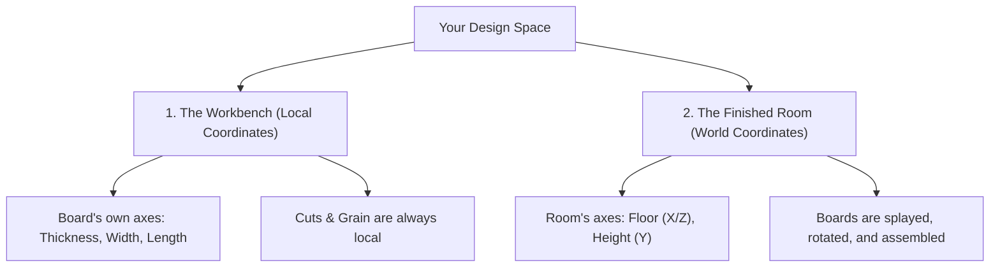

# Sketch: A Parametric Design Tool for Woodworkers
# User Manual & Quick Start Guide

Welcome to **Sketch**! If you know how to pick a board from a lumber rack, mark it with a pencil, cut it on a saw, and join it with screws or glue, you already know how to use Sketch. 

This guide is written specifically for woodworkers. No CAD or engineering experience required!

---

## 1. Quick Start: Your First 5 Minutes in the Shop

Let’s build a simple **Step Stool** to learn the basics.

### Step 1: Pull a Board from the Lumber Rack
1.  Click the **File** menu in the header. Click **New Project** and then click **Discard (Clear Workspace)**.
2.  Click the **Components** button in the header bar.
3.  Click **Custom Board** and set its properties:
    *   **Name:** `Stool Top`
    *   **Length/X/Red dimension:** 12"
    *   **Width/Z/Blue dimension:** 10"
    *   **Thickness/Y/Green dimension:** 0.75" (3/4")
    *   **Position:** [X: 0", Y: 0", Z: 0"]
    Click **Add Component**.

    *   **Note:** This positions the new board at the absolute center of our workspace and as a result, half of the board is under the work surface (by 3/8" or 0.375").
4.  Look at the Inspector Panel for `Stool Top` and click on the button that says, "Set on Floor", and it will move the board up by 3/8" to the working surface 'floor'.
5.  We want to move the Stool Top up 12" so that we can set the legs under the top. In the Inspector Panel for `Stool Top`, set **Position/Y/Green dimension** to 12.375".

### Step 2: Add a Leg
1.  Click **Custom Board** again.
2.  Name it `Stool Leg A`.
3.  Set the dimensions:
*   **Thickness/X/Red dimension:** 0.75" (3/4")
*   **Width/Z/Blue dimension:** 10"
*   **Length/Y/Green dimension:** 12"
4.  Click **Add Component**.

### Step 3: Move the Leg into Position
1.  Look at the Inspector Panel for `Stool Leg A` and click on the button that says, "Set on Floor", and it will move the board to the working surface 'floor'.
2.  In the Inspector Panel for `Stool Leg A`, set **Position/X/Red dimension** to -6". This moves the leg toward the left side of the top, but it's still not flush with the edge of the top. We will fix that in the next step.
3.  Select `Stool Leg A`. In the Inspector Panel, click **+ Add Flush Alignment**.
*   Click the **Left** face on `Stool Leg A`.
*   Click the **Left** face on `Stool Top` to align them. (Be sure to click them in that order! The first component you click is the one that is moved. In this case, the leg is moved to match the position of the top.)

### Step 4: Clone the Leg and Align the Second Leg  
1.  In the Inspector Panel for `Stool Leg A`, under **Clone Component**:
*   Click the **World X** button.
*   Set the **Offset** to `11"`.
Click **Clone along X** to create a clone named `Stool Leg A 2`. Rename it to `Stool Leg B`

2.  Select `Stool Leg B`. In the Inspector Panel, click **+ Add Flush Alignment**.
*   Click the **Right** face on `Stool Leg B`.
*   Click the **Right** face on `Stool Top` to align them.

### Step 5: Group the Components into an Assembly
1.  In the **Outliner** panel, click **+ Assembly** to create a new assembly `Assembly xxx`. Rename it to `Stool`.

2.  In the **Outliner** panel, click on `Stool Leg B` to select it.
3.  Shift-click on `Stool Leg A` to add it to the selection.
4.  Shift-click on `Stool Top` to add it to the selection.
5.  In the **Outliner** panel, drag the component(s): `Stool Leg B`, `Stool Leg A`, `Stool Top` and drop under the `Stool` assembly to group them.

### Step 6: Apply Materials to Components 
1.  Click the **Materials** panel button to open the Paint & Materials selector.
2.  Select `Stool Leg A`. Shift-click `Stool Leg B`.

3.  In the **Materials** panel, select `maple` wood type. This will apply the wood type `maple` to the selected boards.

4.  Select `Stool Top`.

5.  In the **Materials** panel, apply the wood type `walnut` to the selected board.

### Step 4: Check Your Shop Sheet (The Cut List)
1.  Click the **📋 Cut List** icon in the header.

2.  An active sheet appears showing:
    *   `1× | Stool Top | Cherry | 12" × 10" × 0.75"`
    *   `1× | Stool Leg A | Maple | 12" × 10" × 0.75"`
    *   `1× | Stool Leg B | Maple | 12" × 10" × 0.75"`

    *   **Note:** As you design, this list updates instantly. You can print it out and take it directly to your shop!

---

## 2. The Golden Concept: "The Workbench" vs. "The Room"

One of the most important concepts to understand in Sketch is the difference between a board's **Local** coordinates and **World** coordinates. 

We explain this using two distinct workspaces: **The Workbench** and **The Finished Room**.

### 1. The Workbench (Local Coordinates)
Think of a single board lying flat on your workbench in the shop.
*   **Thickness** is how thick the wood is from the face you are looking at to the bench surface. We often build with boards that are 3/4" thick.
*   **Width** is across the grain (from front edge to back edge). We might have a board that is 6" wide.
*   **Length** is along the grain (from left to right or end to end). We might have a board that is 48" long.
*   **The cuts you make** (like a 45° miter or a tilted bevel cut) are marked and cut relative to *this board alone*. If you flip the board, rotate it, or carry it across the room, the cuts and the length of the board do not change.
> [!IMPORTANT]
>
> Every board that is created has it's own set of colored axes (Red along the x axis, Green along the y axis, Blue along the z axis). When you add a board to your project, it's local axes are initially aligned with the world axes. If the board is rotated or tilted, its local axes will no longer be aligned with the world axes. 
>
> When you edit a board's length or adjust a miter/bevel cut, you are working in its **Local Coordinates**. Even if the board is rotated or tilted in your finished model, adjusting its length will stretch the board **along its grain**, regardless of its orientation in **World Coordinates**.

### 2. The Finished Room (World Coordinates)
Now, imagine assembling your furniture piece inside a room.
*   **World Y (Height):** Points straight up from the floor.
*   **World X & Z (Floor):** Points left-to-right and front-to-back across the workshop floor.
*   Once you rotate a board (for example, angling a table leg outward by 10° for a splayed-leg look), its local axes are tilted. "Up" for the board is no longer "up" for the room.

### How to Move and Adjust Tilting Boards
When a board is rotated, Sketch gives you two intuitive ways to move it:
1.  **"Slide along board" (Local Movement):** Moves the board along its own tilted axis. Perfect for sliding a table leg up or down its splayed angle to adjust floor contact, or sliding a shelf deeper into a cabinet.
2.  **"Move in project" (World Movement):** Moves the board straight up, down, left, or right relative to the room floor. Perfect for centering an entire assembly or shifting a drawer face.

### Rotating & Orienting : 
Sketch uses simple woodworking actions to rotate your boards:
*   **Tilt Front/Back (X-Axis):** Leans the board forward or backward. Think of a ladder leaning against a wall.
*   **Spin Flat (Y-Axis):** Spins the board flat on the table, like a turntable or a clock hand. Use this to turn a horizontal shelf so it runs front-to-back instead of left-to-right.
*   **Tilt Left/Right (Z-Axis):** Leans the board sideways. Excellent for creating splayed legs or angled dividers.

All rotations are done in simple (settable) degree increments (like 5° or 45° or 90°), and you can instantly flip a board 180° with a single click in the **Inspector** panel.

---

## 3. Making Cuts: Miters and Bevels

In the real world, you use a miter saw or table saw to cut angles. In Sketch, we use the exact same terms:

### Miters (Turntable Swing)
*   **What it is:** Angled cut across the *width* of the board (swinging the miter saw arm left or right).
*   **Real-world use:** Picture frames, box corners, and mitered cabinet face frames.
*   **In Sketch:** Open the **🛠 Tools** panel, select a board, and adjust the **Miter** slider (from 0° to 60°).

### Bevels (Blade Tilt)
*   **What it is:** Tilted cut through a face of the board (tilting the saw blade from vertical).
*   **Real-world use:** Slanted boxes, tapered legs, or compound miter joints.
*   **In Sketch:** Adjust the **Bevel** slider (from0° to +60°).
    *   *Tilt left:* Shortens the face the blade cuts first. This traditionally the top face of the board
    *   *Tilt Right:* Shortens the opposite face. Usually what we think of as the bottom.

    Note: You can bevel faces in Sketch that would be imposible to bevel in your shop. For instance, you can taper a table leg by beveling all 4 vertical faces by 1 or 2 degrees.
    Whenever you are applying a bevel, spin your view around in world space so that the wood is to the left of the virtual sawblade. In the example of tapering a table leg, the 4 faces you will bevel will be the right, back, left, and front faces, spinning the view 90 degrees after each cut. It is not required to spin the view, but it helps to keep your perspective similar to how you would make cuts in your shop.
    .
---

## 4. Troubleshooting & FAQs

*   **Why did I get a boards physically overlapping warning?**
    *   Sketch has **Collision Detection** enabled by default. If a `warning badge` appears at the top, it means two boards are physically occupying the same space. Use the **Flush** tool or **Nudge** arrows to guide  one of the boards out of the way
*   **How do I undo a mistake?**
    *   Click the **↺ Undo** button in the top menu or press `Ctrl + Z`. Sketch keeps a 25-step history of your session, so you can undo most mistakes when they happen. It's better to make mistakes here than at the table saw!
*   **My input values keep changing slightly!**
    *   Sketch has an auto-clamp safeguard. If you type a value that is physically impossible (like a negative thickness or a bevel greater than 60°), Sketch will clamp it to a safe value and display a helpful notice so your design doesn't break.
*   **Can I switch between Inches (Imperial) and Millimeters (Metric)?**
    *   Yes! You can toggle between **Imperial** and **Metric** at any time in the **Settings** panel. Switching mid-project will **never** alter your actual geometry or corrupt your work—Sketch handles all conversions dynamically under the hood, and your grid snapping automatically updates to sensible metric increments (like 1 mm or 5 mm).
*   **Can I share my projects with other woodworkers?**
    *   Yes! You can save your projects to disk and share them with other woodworkers. They can then open the project in their own Sketch application.

    
